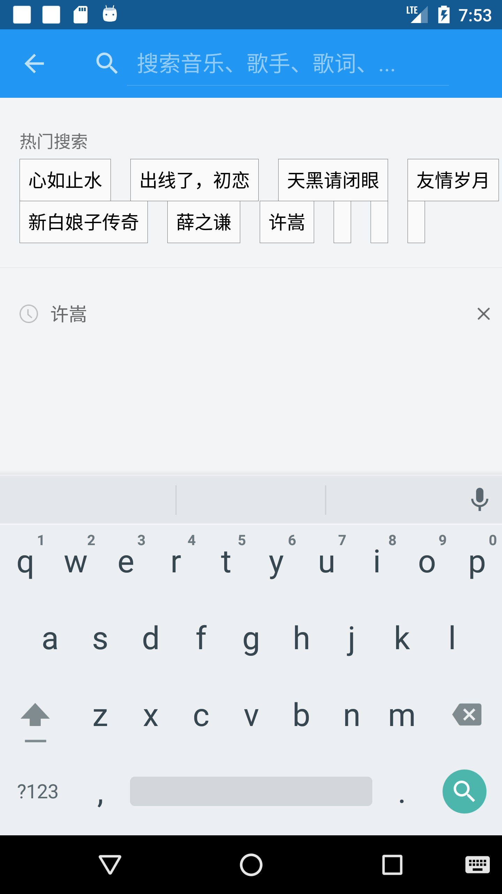

# manyue-music
对仿网易云音乐安卓版客户端[remusic](https://github.com/aa112901/remusic)的改版：
融合了百度云歌单和网易云音乐歌单,提供了更加丰富的歌单资源.

# screenshot

  
   
  
  

  
   
  
  

  
   
  
  

  
   
  
  

  
   
  
  

  
   
  

